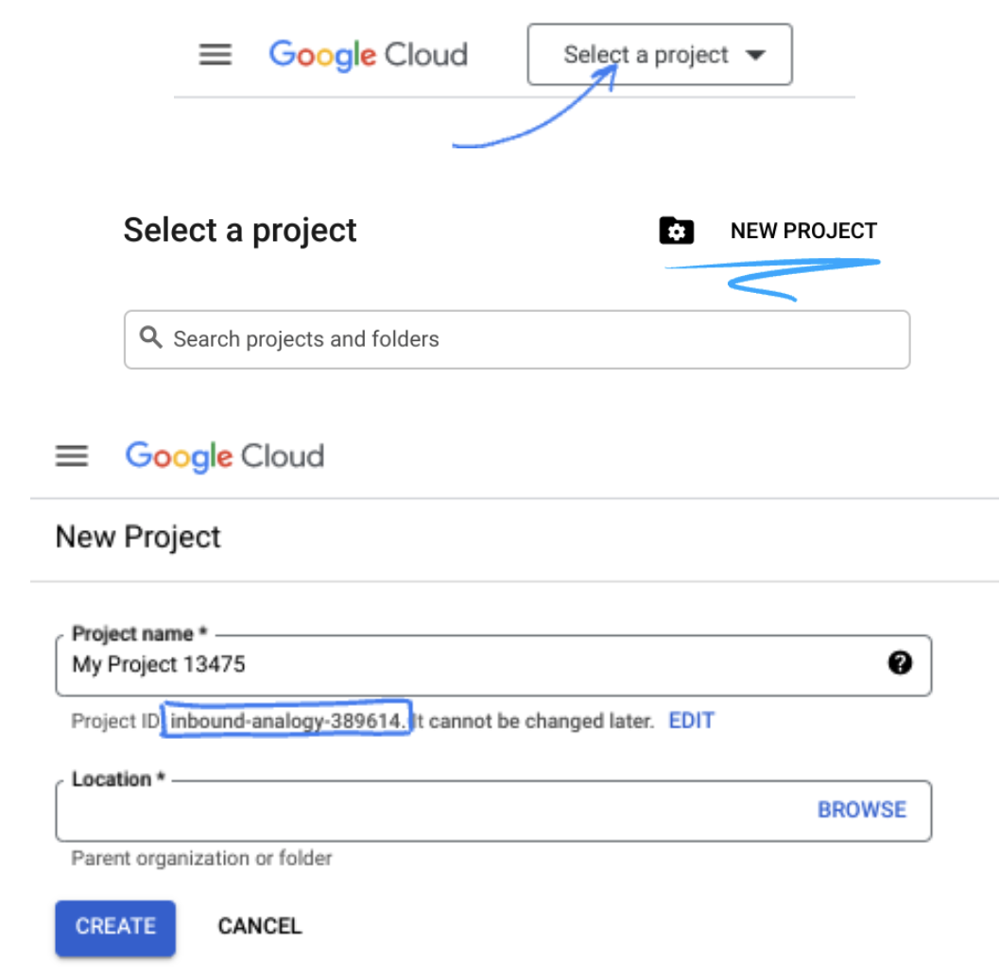

# Self-paced environment setup

1. Sign-in to the [Google Cloud Console](http://console.cloud.google.com/) and create a new project or reuse an existing one. If you don't already have a Gmail or Google Workspace account, you must [create one](https://accounts.google.com/SignUp).

    

    - The **Project name** is the display name for this project's participants. It is a character string not used by Google APIs. You can always update it.

    - The **Project ID** is unique across all Google Cloud projects and is immutable (cannot be changed after it has been set). The Cloud Console auto-generates a unique string; usually you don't care what it is. In most codelabs, you'll need to reference your `Project ID` (typically identified as PROJECT_ID). If you don't like the generated ID, you might generate another random one. Alternatively, you can try your own, and see if it's available. It can't be changed after this step and remains for the duration of the project.

    - For your information, there is a third value, a **Project Number**, which some APIs use. Learn more about all three of these values in the documentation.

2. Next, you'll need to [enable billing](https://console.cloud.google.com/billing) in the Cloud Console to use Cloud resources/APIs. Running through this codelab won't cost much, if anything at all. To shut down resources to avoid incurring billing beyond this tutorial, you can delete the resources you created or delete the project. New Google Cloud users are eligible for the [$300 USD Free Trial](http://cloud.google.com/freeselec) program.

## Start Cloud Shell

While Google Cloud can be operated remotely from your laptop, in this codelab you will be using [Google Cloud Shell](https://cloud.google.com/cloud-shell/), a command line environment running in the Cloud.

From the [Google Cloud Console](https://console.cloud.google.com/), click the Cloud Shell icon on the top right toolbar:


It should only take a few moments to provision and connect to the environment. When it is finished, you should see something like this:


This virtual machine is loaded with all the development tools you'll need. It offers a persistent 5GB home directory, and runs on Google Cloud, greatly enhancing network performance and authentication. All of your work in this codelab can be done within a browser. You do not need to install anything.

Once connected to Cloud Shell, you should see that you are already authenticated and that the project is already set to your project ID.

Run the following command in Cloud Shell to confirm that you are authenticated:

Once connected to Cloud Shell, you should see that you are already authenticated and that the project is already set to your `PROJECT_ID``.

```bash
gcloud auth list
```

#### Command Output

```bash
Credentialed accounts:
 - <myaccount>@<mydomain>.com (active)
```

```bash
gcloud config list project
```

#### Command Output

```bash
[core]
project = <PROJECT_ID>
```

If, for some reason, the project is not set, simply issue the following command:

```bash
gcloud config set project <PROJECT_ID>
```

Cloud Shell also sets some environment variables by default, which may be useful as you run future commands.

```bash
echo $GOOGLE_CLOUD_PROJECT
```

#### Command output

```bash
<PROJECT_ID>
```

## Enable the Google Cloud APIs

In order to use the various services we will need throughout this project, we will enable a few APIs. We will do so by launching the following command in Cloud Shell:

```bash
gcloud services enable cloudbuild.googleapis.com cloudfunctions.googleapis.com run.googleapis.com logging.googleapis.com storage-component.googleapis.com aiplatform.googleapis.com
```
After some time, you should see the operation finish successfully:

```bash
Operation "operations/acf.5c5ef4f6-f734-455d-b2f0-ee70b5a17322" finished successfully.
```

## Clone the Repository

We've put all the samples you need for this project into a Git repo in the `sample_apps` folder. Clone the repo in Cloud Shell using the following command:

```bash
git clone https://github.com/GoogleCloudPlatform/generative-ai.git
```

